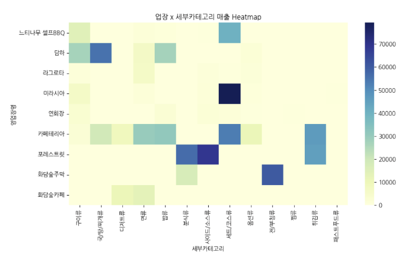

# 식음업장 메뉴 수요 예측 AI 온라인 해커톤

상위 작업: 수상작 리뷰 (https://www.notion.so/2ff97af0e162802fb79cce0b3a7f970b?pvs=21)
진행 상태: 완료

대회 제목 : **식음업장 메뉴 수요 예측 AI 온라인 해커톤**

대회 주제 : 리조트 내 식음업장 메뉴별 1주일 수요 예측 AI 모델 개발

링크 :[https://dacon.io/competitions/official/236559/codeshare/12973?page=1&dtype=recent](https://dacon.io/competitions/official/236559/codeshare/12973?page=1&dtype=recent)

## 데이터

- train.csv의 행은 102676, 열은 3개를 가지고 있으며, 매출수량이 target이다.
- column 명에는 영업일자, 영업장명_메뉴명, 매출수량이 있음.

## **EDA**

- 업장, 메뉴에 따라 매출규모와 패턴이 다름 → **카테고리화 + 범주형 피처로 변환**

- 겨울과 봄, 평일보다는 주말에 평균 매출이 증가하는 것으로 나타남→ 요일, 주말 여부, 연중위치 등의 시간 관련 **파생 변수** 생성
- 특정 메뉴에 따라 계절성을 가짐 → mean,std, trend 지표 + 계절성 지표 피처 생성
- 매출 분포의 비대칭성 O → 로그 스케일
- 매출 분포의 이상치 O → clipping 지표 피처 생성

## 전처리

- 결측치 : 0으로 통일
- 이상치
    - winsoring 기법 : 이상치를 99% 값으로 대체
    - 재로 패턴 피처화 : 매출이 0이라는 패턴을 학습하기 위해서 zero_frac28, zero_run max28과 같은 파생 변수들을 만들어냄.
        - zero_frac28 : 최근 28일동안 매출이 0이었던 날짜의 비율을 말함.
- 스케일링/ 정규화
    - 매출 : log scale로 변환
- 범주형 인코딩
    - tree 모델 : 범주형 데이터 처리
    - DL 모델 : Label encoding → 범주형 데이터로 변환 → 고차원 벡터로 변환
- 피처 엔지니어링
    - sliding window : 입력 28일 → 라벨 7일
    - 시계열 통계 피처 생성
    - 요일, 주말 여부와 같은 시간 정보→ 숫자로 변환
    - 메뉴명 → 상위_세부 카테고리로 묶어서 진행

## **모델링**

- LGBM, XGB, LSTM, GRU, Transformer, TCN을 base model로 하여서 ensemble을 진행함

- 단순히 가중치를 부여하는 것에서 멈추지 않고 두개의 앙상블 모델을 만들어서 최종 결과를 만들어냄.
- GRU/LSTM/TCN/Transformer + LGBM/ XGB
- GRU/Transformer + LGBM

## 느낀점/배운점

- 단순히 여러 모델을 조합하는 ensemble에서 멈추지 않고, ensemble 모델을 만든 이후에도 clipping, shrinkage, smoothing, asymmetric 보정과 같은 후처리 과정을 추가로 적용하여 모델의 정확도를 높이고자 한 부분이 인상적이었다.
    - 이를 통해 모델을 구축하는 단계에서 끝나는 것이 아니라, 예측값을 세밀하게 보정하는 과정 또한 성능 향상에 중요한 역할을 한다는 점을 배우게 되었다
- tree 기반 모델과 DL 모델의 특성을 구분하여 전처리를 다르게 적용한 점도 배울 점이었다. Tree 모델은 범주형 데이터를 자체적으로 처리할 수 있다는 점을 고려해 별도의 label encoding을 진행하지 않았고, DL 모델에 대해서만 인코딩을 적용함
    - 모든 모델에 동일한 전처리를 적용하기보다, 각 모델의 구조와 특성에 맞는 전략을 설계하는 것이 중요하다는 것을 느끼게 되었다.